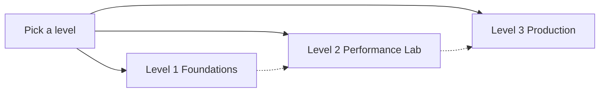
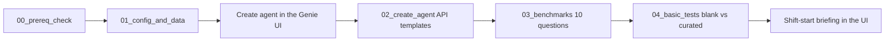
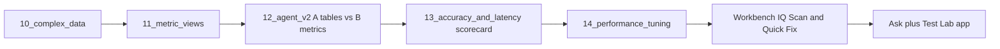
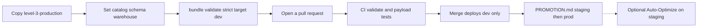

# Manufacturing Genie Workshop

Hands-on series for Databricks Genie Agents. The story company is fictional: **Apex Precision Manufacturing** (six plants, automotive components, industrial pumps, and electronics assembly).

Pick a level. Each level is self-contained. Later levels reuse the same Apex model.

| Level | Who | Time | You leave with |
|---|---|---|---|
| [1 Foundations](level-1-foundations/) | Analysts, BI leads, first-time authors | 2 hours | A curated agent at 10/10 on 10 benchmarks |
| [2 Performance Lab](level-2-performance-lab/) | Data engineers, SAs | 4 hours | Accuracy and p50/p95 scorecard plus a test app |
| [3 Production Scale](level-3-production/) | Platform / CoE | Full day | A forkable bundle, CI for **dev**, and a runbook |

Later levels reuse the same Apex model. You can stop after any level.

## What you get

- Seed data and notebooks that run on **serverless**
- Catalog-parameterized Genie agent templates (blank and curated)
- Metric views for OEE, FPY, and maintenance (Level 2)
- A Databricks Asset Bundle for agent, jobs, app, and permissions (Level 3)
- GitHub Actions that deploy **dev** only; staging and prod are manual steps in `PROMOTION.md`

## How this workshop improves an agent

You curate Apex by hand in Level 1. Level 2 and Level 3 add tools around that same agent.

| Tool | When | What it does in class |
|---|---|---|
| **IQ Scan** | Level 2 | Scores the agent on a 12-check checklist (instructions, examples, joins, benchmarks). Deterministic. No Prompt Registry. |
| **Quick Fix** | Level 2 | Suggests patches for failing IQ Scan checks. You apply them, rescan, and rerun benchmarks. |
| **Human PR loop** | Level 3 (default) | A thumbs-down or a failed benchmark becomes a pull request. CI validates. A person promotes. Nothing writes to prod by itself. |
| **Auto-Optimize** | Level 3 (optional) | Workbench job that clones the agent, proposes instruction or example-SQL changes, and keeps a change only if benchmarks improve on train, validation, and a holdout set. Rolls back if the score drops. Needs Managed MLflow Prompt Registry from workspace **Previews** (Beta). Skip this module if that preview is off in the class workspace. |

**MaxGenie** was an earlier Databricks Solutions skill that did the clone, train / validation / holdout, and rollback pattern as a standalone optimizer. Databricks archived that repo and folded the workflow into **Genie Workbench** Auto-Optimize. This workshop does not install MaxGenie. If a facilitator mentions the name, treat it as history, not a second product to deploy.

IQ Scan and Quick Fix still need a Claude Sonnet endpoint on Foundation Model APIs. Your facilitator may host Workbench if the class workspace does not.

## Prerequisites

Run `shared/00_prereq_check` before class. It checks:

1. Workspace login
2. Databricks SQL entitlement
3. CAN USE on a SQL warehouse (serverless or Pro)
4. Serverless notebook compute
5. Catalog and schema grants (USE CATALOG, USE SCHEMA, CREATE TABLE, and related)
6. CREATE CATALOG (optional; most people skip this)

You also need Unity Catalog and Genie enabled. Workspace admins turn on **Managed MLflow Prompt Registry** from **Previews** only if you will run Auto-Optimize.

## How to run

### 1. Configure

1. Import this repo into your workspace so `shared/` sits next to `level-1-foundations/`.
2. Open `shared/00_config`.
3. Set the **catalog**, **schema**, **warehouse_id**, and **repo_root** widgets. `repo_root` is the workspace folder that contains `shared/` (example: `/Workspace/Users/<you>/Manufacturing-Genie-Workshop-v2`).
4. Run the notebook. It fails fast if catalog, schema, or warehouse are still placeholders.

Do not commit workspace hostnames, warehouse ids, or emails.

### 2. Level 1 (2 hours)

Create a curated Apex agent and get it green on 10 benchmarks.

Run in order, on serverless:

1. `shared/00_prereq_check`
2. `level-1-foundations/01_config_and_data`
3. Create the agent in the Genie UI first, then run `level-1-foundations/02_create_agent`
4. `level-1-foundations/03_benchmarks`
5. `level-1-foundations/04_basic_tests`

Facilitator click-path: `level-1-foundations/FACILITATOR_GUIDE.md`.

### 3. Level 2 (4 hours)

Measure accuracy and latency, then score the agent in Workbench.

Same widgets. Use a schema for Level 2 (example: `<catalog>.<schema_l2>`). Run `10_complex_data` through `14_performance_tuning`, then the Workbench IQ Scan lab. Optional: vibe-code the Ask + Test Lab app from `level-2-performance-lab/vibe/PROMPT.md`.

Default telemetry is 10 million rows. Set widget **telemetry_rows** to `50000000` only if you have time and warehouse capacity.

### 4. Level 3 (full day)

Put every asset in a bundle. GitHub Actions deploy **dev** only. Staging and prod stay manual.

1. Copy `level-3-production/` as your project.
2. Set bundle variables (`catalog`, `schema`, `warehouse_id`) per target.
3. `databricks bundle validate --strict --target dev`
4. Open a PR. GitHub Actions run `bundle validate` and the payload tests. Run the IQ Scan floor in Workbench before you promote (see `PROMOTION.md`).
5. Merge deploys **dev** only.
6. Follow `level-3-production/PROMOTION.md` for staging and prod.

## Limitations

- Benchmark scoring is exact. TIMEOUT, NO_ANSWER, and ERROR count as FAIL.
- Genie Conversation API is about 5 questions per minute on the free tier. The Test Lab throttles.
- Metric view materialization cannot be used with row filters, column masks, or ABAC.
- Entity matching cannot be used on columns that have row filters or masks.
- Auto-Optimize is optional. Prompt Registry is workspace Beta, not Public Preview. Skip the module if the preview is off.
- `genie-iq-score-lite` is not on public PyPI. Level 3 lint uses Workbench IQ Scan or a vendored scorer.

## References

- [Create and manage a Genie Agent](https://docs.databricks.com/aws/en/genie/set-up)
- [Unity Catalog metric views](https://docs.databricks.com/aws/en/metric-views/)
- [Declarative Automation Bundles](https://docs.databricks.com/aws/en/dev-tools/bundles/)
- [Genie One MCP](https://docs.databricks.com/aws/en/agents/mcp-tools/genie-mcp)
- [Prompt Registry](https://docs.databricks.com/mlflow3/genai/prompt-version-mgmt/prompt-registry/)
- [Manage previews](https://docs.databricks.com/aws/en/admin/workspace-settings/manage-previews)
- [Genie Workbench](https://github.com/databricks-solutions/databricks-genie-workbench)

## Files

| Path | Use |
|---|---|
| `shared/00_config` | Set catalog, schema, warehouse |
| `shared/00_prereq_check` | Six access checks before class |
| `shared/lib/genie_client.py` | All Genie REST calls |
| `level-1-foundations/` | Foundations notebooks and templates |
| `level-2-performance-lab/` | Performance lab, metric views, app |
| `level-3-production/` | Bundle, CI for dev, promotion runbook |
| `cleanup/` | Tear down workshop objects |

## License

Apache License 2.0. See `LICENSE`.
